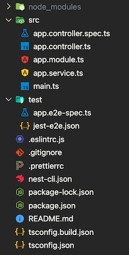

# NestJS101

> 🔥두둥🔥 드디어 그 좋다고 소문이 자자한 `NestJS`를 알아보고자 한다. Learning by Doing에 충실한 [Nomad Coders NestJS](https://nomadcoders.co/nestjs-fundamentals)를 통해서 만들어보고 해당 내용을 [공식문서](https://nestjs.com/)를 통해서 직접 찾아보면서 정리해보고자 한다.

NestJS에 대해서 간략하게 설명하면, 몇가지 단어로 압축할 수 있을 것 같다.

- `Node.js 서버 사이드 어플리케이션`을 위한 `프레임워크`
- `타입스크립트`(fully support) 사용
- `기업` 규모(큰 규모)의 어플리케이션을 위한 프레임워크

  > ✅ Build Enterprise!

- can create `testable(테스트 가능한), scalable(확장 가능한), loosely coupled(느슨한 결합도), easily maintainable(쉬운 유지보수)` applications

  > ✅ Nest Application / Architecture의 방향성

  > > 참고로 이러한 nest의 아키텍처는 `앵귤러`에 **heavily** 영향을 받아서 만들어졌다고 한다. 이러면 앵귤러를 맛보기로 해봐야좋을지...😅 할게 많아지네 🤬

<br />

## Setup NestJS Project

```shell
  npm i -g @nestjs/cli

  nest new <project name>
```

위의 명령어로 NestJS프로젝트를 시작한다. `@nestjs/cli`는 CLI를 통해서 Nest 프로젝트를 시작하고, 개발하며 유지보수하는데 도움을 주는 툴이다. 이것을 전역으로 설치해준 후, 그 아래 명령어를 통해서 Nest 프로젝트를 시작할 수 있다.

<br />

## NestJS Architecture

위에서 설명한 명령어를 통해서 만들어진 프로젝트는 아래와 같은 최초 디렉터리 구조로 가진다. 여기서 익숙한 node_modules, test등의 디렉터리와 덜 익숙한 여러가지 설정 파일을 확인해 볼 수 있다.



입문자에게 가장 중요한 곳은 바로 src 디렉토리. 이 곳에는 **5가지의 주요 파일**이 있다. 각각의 파일에 대해선 간략히 표현하면 아래와 같다.

|                    파일명                    |                    기능                    |
| :------------------------------------------: | :----------------------------------------: |
| [app.controller.ts](./doc/app.controller.md) |    라우팅을 가진 기본적인 컨트롤러 파일    |
|            app.controller.spec.ts            | 컨트롤러에 대한 유닛테스트를 구현하는 파일 |
|     [app.module.ts](./doc/app.module.md)     |          어플리케이션의 루트 모듈          |
|    [app.service.ts](./doc/app.service.md)    |        서비스 로직을 구현하는 파일         |
|           [main.ts](./doc/main.md)           |         어플리케인션의 엔트리 파일         |

<br/>

> 각각의 파일에 대한 좀 더 자세한 설명은 해당 파일을 클릭하면 된다. 최초 코드를 바탕으로 설명한다.

<br/>

## REST API

<br/>

## Unit Testing

<br/>

## E2E Testing
